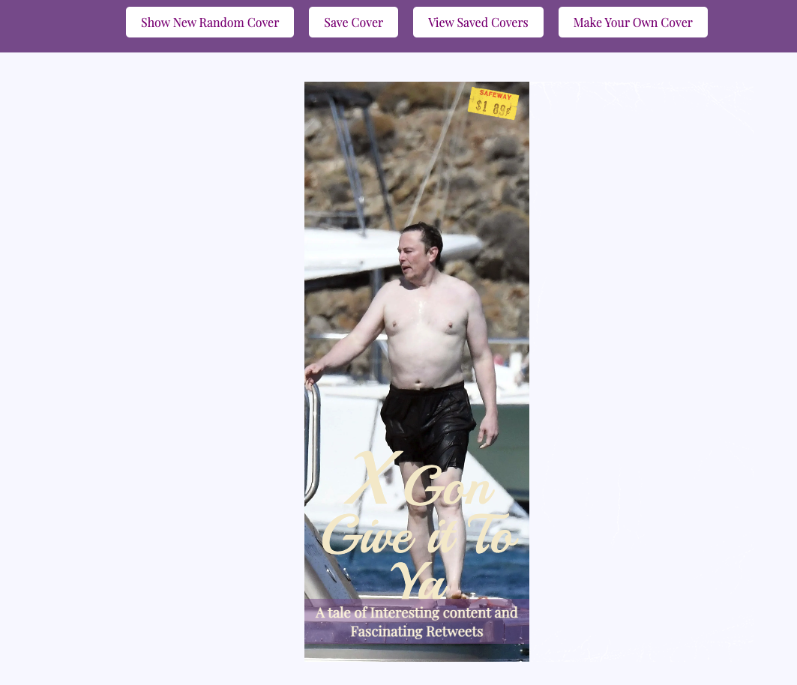

∂# RomCom  

### Live GitHub Site:
[//]: <> (What site can a person access your live site?)
https://zachwolek.github.io/RomanceNovelShelf/

### Abstract:
[//]: <> (Briefly describe what you built and its features. What problem is the app solving? How does this application solve that problem?)
The app solves the problem of creating content for romance novel afficionados. The app can either generate romance novels randomly, or create to exact specifications of the user. These romance novels can get saved to a user bookshelf and deleleted by the user

### Installation Instructions:
[//]: <> (What steps does a person have to take to get your app cloned down and running?)
1) Access the form here: https://github.com/zachwolek/RomanceNovelShelf
2) Copy the SSH repository URL git@github.com:zachwolek/RomanceNovelShelf.git
3) Open terminal and 'cd' into the directory you wish to clone 
4) Clone the repository by submitting `git clone git@github.com:zachwolek/RomanceNovelShelf.git`

### Preview of App:
[//]: <> (Provide ONE gif or screenshot of your application - choose the "coolest" piece of functionality to show off.)
Easily the coolest piece of functionality is the ability to generate any book limited by your own imagination. Example of dynamic functionality: 

### Context:
[//]: <> (Give some context for the project here. How long did you have to work on it? How far into the Turing program are you?)
Lydia and Zach are both in their second week of the first academic "module" of four at Turing School of Software & Design. The project was assigned to be completed at the end of the second week and worked on after class and over the weekend.  

### Contributors:
[//]: <> (Who worked on this application? Link to their GitHubs.)
Lydia Sims: https://github.com/LISims88/
Zach Wolek: https://github.com/zachwolek/

### Learning Goals:
[//]: <> (What were the learning goals of this project? What tech did you work with?)
The learning goals of the project were to manipulate the DOM using javascript functions. We used HTML, Javascript, and referenced CSS in order to create unified collaboration presenting a webpage document. 

### Wins + Challenges:
[//]: <> (What are 2-3 wins you have from this project? What were some challenges you faced - and how did you get over them?)
Wins:
1) Learning the double-click event handler and affixing it to an ID associated with the book to delete. This was achieved through pseudo-coding a function plan and web searching methods for individual steps we were stuck on. 
2) Collaborating while balancing work-life was accomplished with open communication and compromise to be able to meet each other in periods of dedicated time that would ensure the deadline would be made. 
3) Learning the interrelationship between HTML/Java/CSS was another win, being that this was a relatively new concept it required study, manipulation, and peer review to compare understandings of functionality. 
